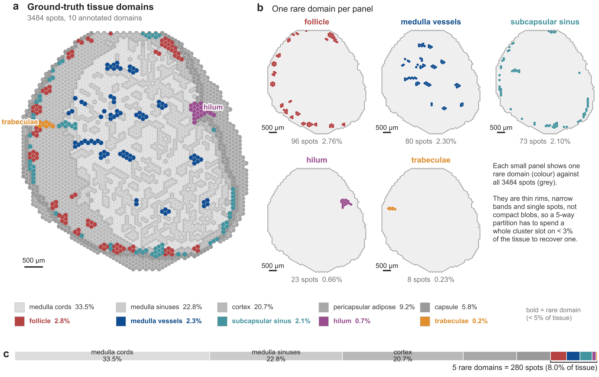
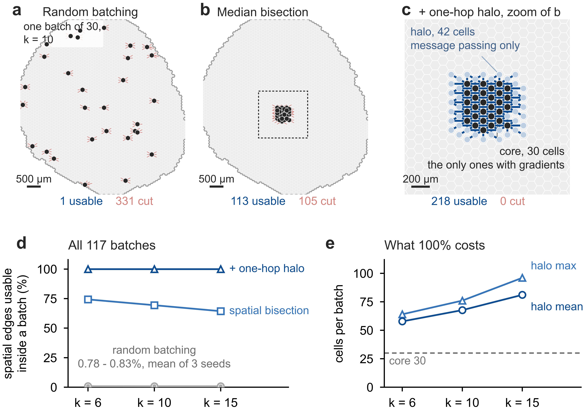
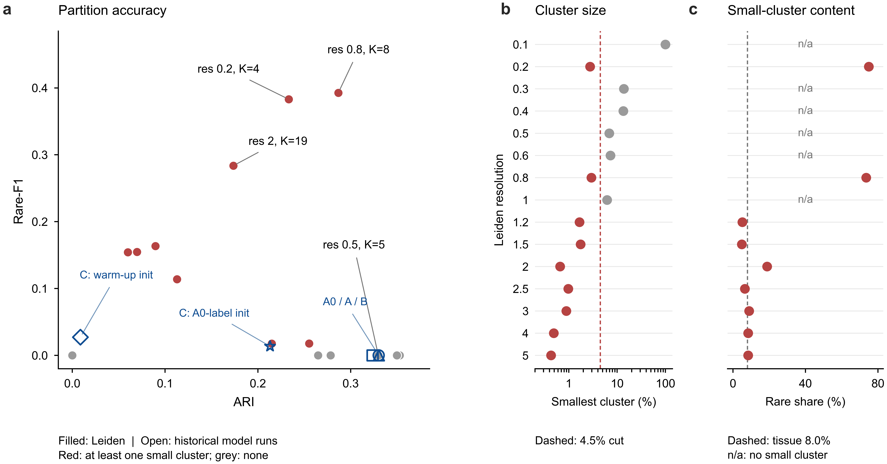
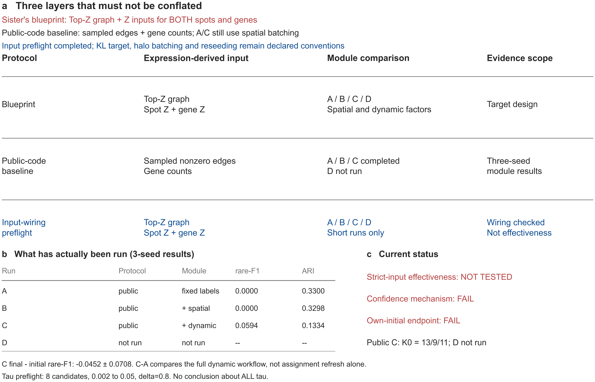
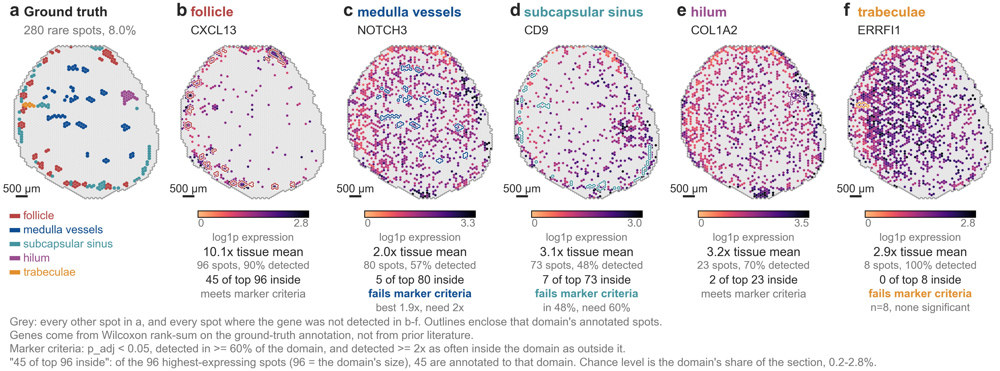

# Spatial-scFormer

把 scFormer（异质图 Transformer，原本做单细胞稀有状态识别）改造成空间转录组版本：给 spot–spot 加空间邻接，把训练前固定死的 Leiden 伪标签换成可以更新的原型动态聚类，然后回答一个问题——

**稀有组织域检不出来，是不是固定伪标签卡住的？**

当前在人类淋巴结 Visium 切片 A1（3484 spot × 18085 gene，10 个注释域）上做单模态 RNA 消融。5 个稀有域是薄环、细带和小点，合计 280 个 spot，占切片 8.0%；主终点 rare-F1，次终点 ARI / NMI。这个仓库是项目主工作仓：方法代码、实验入口、run 产物和进展报告都在这里，按 Stage 0→5 推进，自己接着跑、合作者来核验，都从下面的目录结构和口径边界读起。

完整分析见 **[进展报告 PDF](report/Spatial-scFormer_Progress_Report.pdf)**（2026-09-09，18 页）。

## 当前结果，先说结论

下面四个结果都在**公开代码输入协议**下测得（随机 gene 采样 + counts 输入），还不是论文要求的 Top-Z 图与 Z-score 输入——这个差别实测很大：公开代码选基因与论文 Top-20 Z 的重合只有 1.0–1.6%，每个 spot 拿到的边是中位 156 条而不是 20 条。所以下表叫「公开代码基线模块对照」，不叫完整蓝图复现。

| 实验 | 回答的问题 | 结果（3 seed） |
|---|---|---|
| B − A | 加空间边有没有用？ | ARI 配对差 −0.0002 ± 0.0005，跨 seed 翻符号；rare-F1 两臂都是 0——默认初始划分里没有小簇，这个终点在这批 run 上测不了 |
| B − A（res 0.8 复核） | 换有测量能力的初始划分再测一次 | +0.0014 ± 0.0065，仍跨 seed 不同向，比 arm A 自己的 seed 波动（sd 0.0068）还小；效应门不过 |
| C − A | 换成动态聚类呢？ | rare-F1 +0.0594 ± 0.0262，但 ARI −0.1966 ± 0.0340、NMI −0.2047 ± 0.0231 同向变差，不能合称改善 |
| C final − initial | 动态聚类有没有保住自己的初始划分？ | −0.0452 ± 0.0708，逐 seed −0.0546 / +0.0298 / −0.1108；训练结束时只有 seed 0 还有 spot 过 q > 0.8 置信门 |

读数有一条边界：这些都写成「当前协议下没测到」，不写成「没用」。测不出和测到零是两回事。

## 问题长什么样

rare-F1 这个终点为什么难：稀有域不是一块完整区域，是贴着包膜的薄环（follicle）、髓质里的细带（medulla vessels）和零星小点（hilum 只有 23 个 spot，trabeculae 只有 8 个）。柱状图给不了这个形状，模型要在一个 5-way 分区里把 0.2%–2.8% 的瓦片单独聚出来。



## 已经站住的两个结论

**1. 空间边要真能进 message passing，batch 内两端都得在场。** 上游随机采样把一个 batch 的 30 个 spot 撒满整张切片，k=10 时只有 0.8% 的空间边能用——Stage 1 要是不先修这个，量到的会是采样器，不是空间关系。换成空间中位二分后 69.4% 的边留在 batch 内，再补一跳 halo 后 100% 一条不丢，代价是 batch 从 30 个 spot 长到 58–81 个。



**2. rare-F1 = 0 不是 K=5 装不下。** 构造法证明：把 10 个真值类合并成恰好 5 组，rare-F1 上限是 1.0000（两个小于 4.5% 判据的簇 + 一个大簇就够）。问题是默认 resolution 0.5 的初始划分结构上不产生小簇——扫 resolution 后，0.2 和 0.8 的划分自带富集稀有的小簇，rare-F1 分别到 0.3830 和 0.3927。



## 方法与现状一览

设计蓝图要求 Top-Z spot-gene 图加双节点 Z-score 输入做共同基底，在这之上依次加空间关系、动态聚类。当前实现与基底的对齐状态、每条修改点跑到哪一步，这张图一次说清：



## 生物学边界：五个稀有域里只有 follicle 在表达上站得住

在真值上做 Wilcoxon（p_adj < 0.05、域内检出率 ≥ 60%、检出倍数 ≥ 2×）：只有 follicle 有明确专一的 marker（CXCL13，域内检出 90%，表达是全片均值的 10.1 倍，表达最高的 96 个 spot 里 45 个在域内，是随机水平的 17 倍）。另四个域至少有一条判据不过，trabeculae 只有 8 个 spot，校正后没有任何显著基因。所以 rare-F1 上不去时，不能默认「表达有信号、是模型不行」——除了 follicle，这个前提目前没被排除也没被证实。



## 仓库结构

```
Spatial-SC-Former/
├── report/                  进展报告 PDF（2026-09-09，18 页，含全部 11 张图与完整口径）
├── figures/                 README 展示图
├── src/spatial_scformer/    方法核心包
│   ├── graph/               空间 kNN 图、空间分批 + halo、论文 Top-Z 选边
│   ├── cluster/dynamic.py   原型动态聚类（置信门控刷新、空簇重新播种、K 固定）
│   ├── model/hgt.py         异质图模型（spot/gene 双节点 + 空间第三 relation）
│   ├── losses.py            L_KL（重构）与 L_proto（原型对比）
│   └── stage1_trainer.py / stage2_trainer.py / train.py
├── scripts/
│   ├── run_stage0_baseline.py   上游 scFormer 基线复现（Stage 0）
│   ├── run_stage1.py            arm A / B：空间关系开关是唯一差别（Stage 1）
│   ├── run_stage23.py           arm C / D：动态聚类 ± 空间（Stage 2/3）
│   └── figures/                 报告图 F1–F11 的生成脚本
├── configs/                 消融默认配置、stage 配置、协议快照（主线 + 严格输入基线）
├── experiments/
│   ├── runs/                run 产物（metrics.json、初始/最终划分），报告引用的 run 都在
│   └── reports/             汇总与诊断 JSON（goal_stage1/2、tau 前检、表示质量、基线前沿）
├── third_party/scFormer/    上游代码冻结快照（commit 7401620，只 import 不改动）
└── docs/data.md             数据获取与放置说明
```

## 快速开始

```bash
# Python >= 3.10；GPU 可选（正式 run 在约 1.6 GB 显存的卡上即可）
pip install -r requirements.txt
```

数据不随仓库分发，把 `adata_RNA.h5ad` 放到 `data/raw/human_lymph_node_A1/`，要求见 [docs/data.md](docs/data.md)。

```bash
# Stage 0：上游 scFormer 基线（A0）
python scripts/run_stage0_baseline.py --epochs 100

# Stage 1：A/B 两臂，唯一差别是空间 relation 开关；换伪标签 resolution 加 --pseudo-resolution 0.8
python scripts/run_stage1.py --arm A --seed 0
python scripts/run_stage1.py --arm B --seed 0 --spatial-k 10

# Stage 2/3：C/D 两臂，动态聚类 ± 空间
python scripts/run_stage23.py --arm C --seed 0
python scripts/run_stage23.py --arm D --seed 0
```

每个 run 在 `experiments/runs/<run_id>/` 落盘 `metrics.json`（超参、图口径、伪标签 resolution、稀有类逐类召回、GPU 峰值等全部字段）和 `pred.npy` 等产物。run_id 自带全部关键开关，不同协议不会混写进同一目录。

报告图用 `scripts/figures/` 下的脚本重绘，例如：

```bash
python scripts/figures/report_figures.py --only F1 F5      # 依赖 experiments/ 下的 run 产物与数据
python scripts/figures/method_diagram.py                    # F9，不依赖数据
```

## 口径边界（读结果前先看这个）

能说：

- arm A 跑满 100 epoch 的输出基本就是训练前那次 Leiden 的复制（res 0.8 上 ARI vs 伪标签 0.9623–1.0000，seed 0 逐点恒等，3484 个 spot 改了 0 个）；
- 第一版无权重空间边在两份初始划分上都没有可测效应，k = 6 / 10 / 15 不改变结论；
- 公开代码基线 C 的结果门和置信机制门都没有跨 seed 通过；
- follicle 在表达层面明确可分。

不能说：

- 「空间关系无用」「动态聚类无用」——测不出不等于测到零；
- 「所有稀有域都被检测到」或「都检不到」——必须逐类、逐协议核对；
- 把 resolution 0.5 与 0.8 两支的 rare-F1 横着比——那是两份不同的初始划分。

## 下一步

1. 对齐 Top-Z / Z-score 共同输入基础（协议见 `configs/strict_input_baseline.json`；A–D 接线检查已通过，core spot 边数中位 20，短跑不提供效果结论）；
2. 基础固定后重登记多 seed arm A，再只开空间边比较 B；
3. τ/δ 单因素校准（固定 δ=0.8 的 8 个 τ 候选前检未通过，结论限于这批候选），然后才是同协议 D 与完整 A/B/C/D 消融。

## 引用与许可

- 方法基础：scFormer（DOI: 10.1007/s44307-026-00121-y），上游代码快照见 `third_party/`，版权归上游作者；
- 本仓库新增代码以 MIT 许可发布，见 [LICENSE](LICENSE)。
